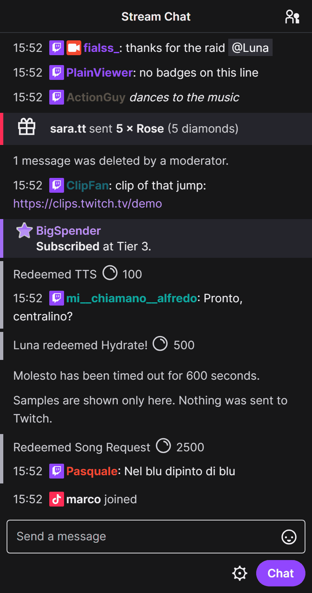
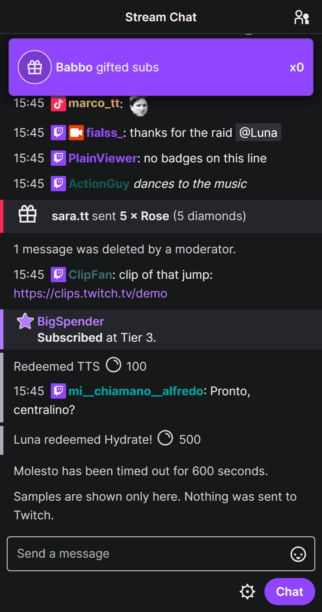
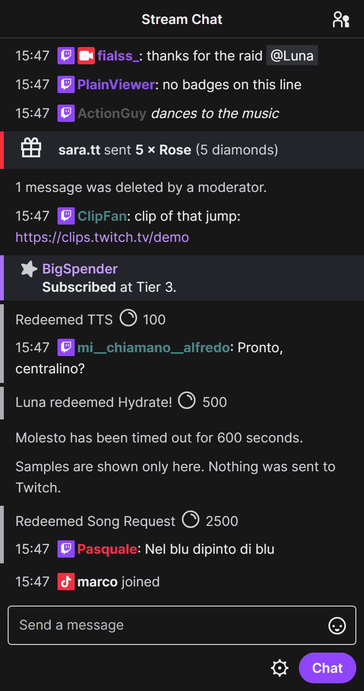
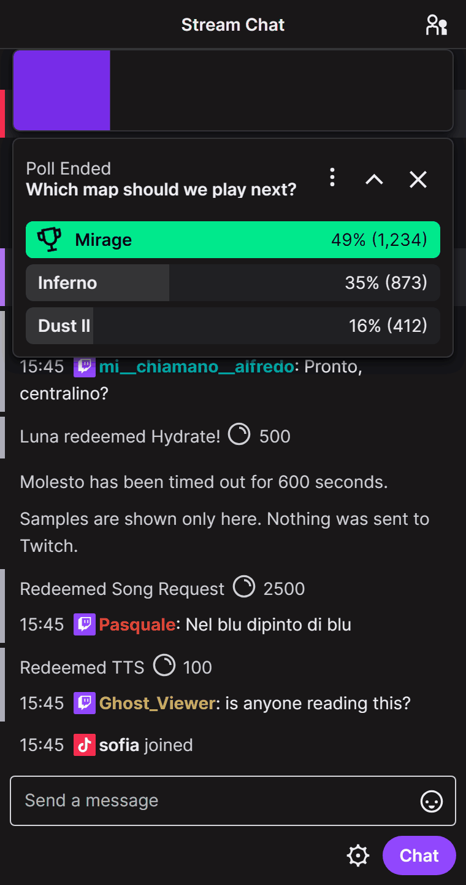
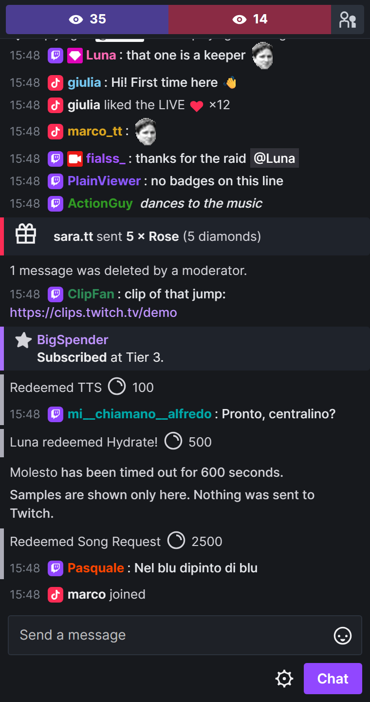
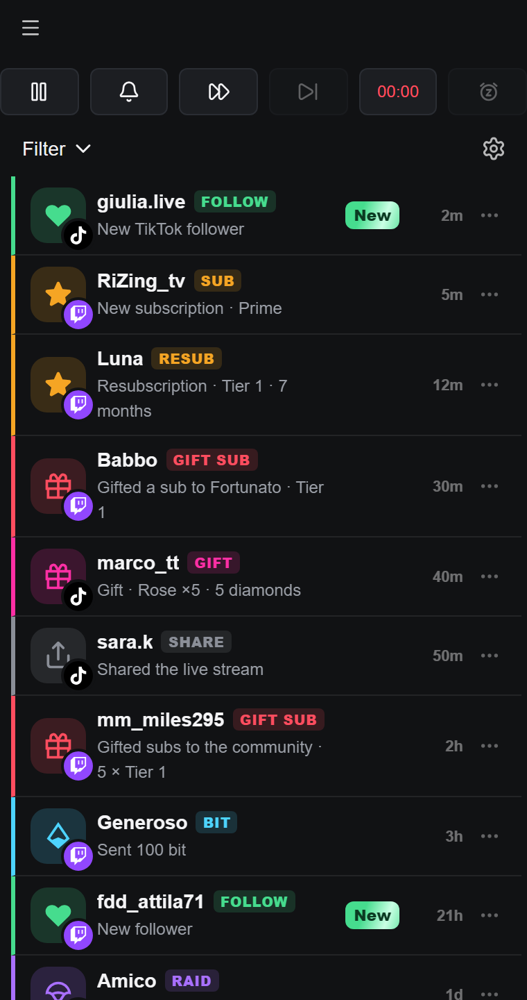
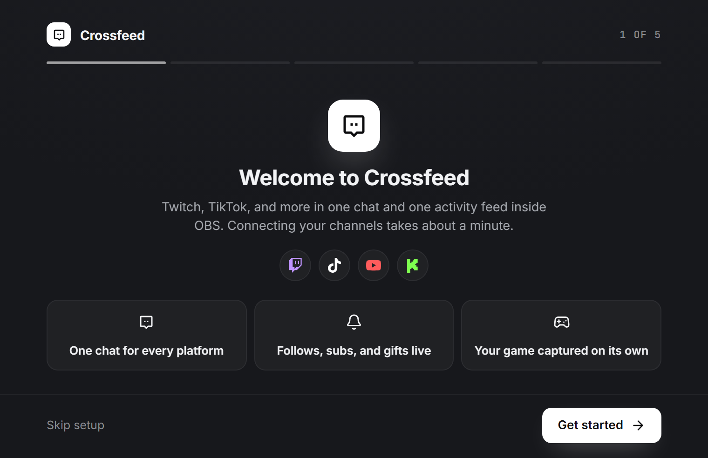

# Crossfeed

  

**Crossfeed** puts your Twitch and TikTok chat in one OBS dock that looks and works like Twitch's own chat, plus an activity feed with follows, subs, gifts and raids. It runs inside OBS: no browser tab, no extra window.

<table>
  <tr>
    <td align="center" width="33%"> <b>One chat</b> Twitch and TikTok together: emotes, TikTok gifts, likes and who joins</td>
    <td align="center" width="33%"> <b>Twitch's highlights</b> Gift banners, Hype Train and polls at the top of the chat</td>
    <td align="center" width="33%"> <b>Gifted subs</b> The banner with confetti, then who got each sub</td>
  </tr>
  <tr>
    <td align="center" width="33%"> <b>Predictions</b> Start, points on both sides, lock and result</td>
    <td align="center" width="33%"> <b>Multistream style</b> Compact chat with live viewers per platform</td>
    <td align="center" width="33%"> <b>Activity dock</b> Follows, subs, gifts, bits and raids, with alert controls</td>
  </tr>
</table>

   
  <b>Setup Wizard</b>: connect your channels in about a minute.

Previews use sample data: type <code>/demo</code> in the chat to see them in your own OBS. Nothing is sent to Twitch.

## Install

1. Download `Crossfeed-Setup.exe` from the [latest release](https://github.com/Fialsss/crossfeed-releases/releases/latest).
2. Close OBS and run the setup. If the Microsoft Visual C++ runtime is missing, the setup downloads it from Microsoft.
3. Open OBS, then choose **Crossfeed → Setup Wizard** to connect your channels.

Requires Windows 10 or 11 (x64) and OBS Studio 30.0.2 or later, installed normally (not the portable version).

## Updates

Crossfeed checks `manifest.json` in this repository once a day and downloads only the files that changed, from the folder of the new version. Each file is checked against its SHA-256 before anything is written.

The new version starts the next time OBS starts. Until then, the version you are running keeps working as it was.

If Crossfeed asks you to **Reconnect** Twitch after an update, everything else keeps working. The new permission is only for the new features.

To turn updates off, clear **Crossfeed → Automatic Updates**. **Crossfeed → Check for Updates** checks right away.
